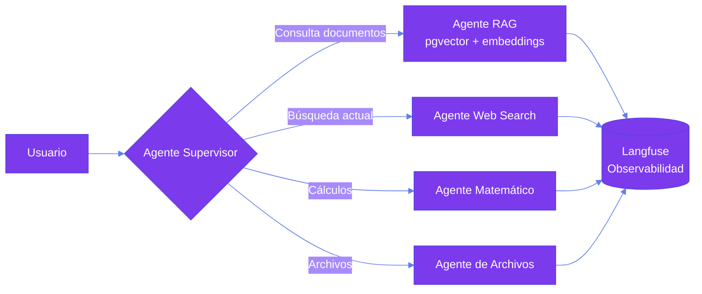

 

&nbsp;

&nbsp;

&nbsp;

 

> [!NOTE]
> Soy **Joaquín Mancilla**, Analista Programador titulado y estudiante de Ingeniería en Informática en INACAP.
> Trabajo como **Full Stack Developer / AI Developer** en una startup de Inteligencia Artificial, diseñando agentes LLM con **LangChain** y **LangGraph**, sistemas **RAG** sobre **PostgreSQL + pgvector** y APIs con **FastAPI**.
> Cuando no estoy construyendo agentes, probablemente esté creando algo en **Unity**.

 

---

## 💼 Experiencia

**Full Stack Developer / AI Developer** — Startup de Inteligencia Artificial · *Enero 2026 – Actualidad*

- 🧠 Diseño e implementación de agentes LLM con **LangChain** (arquitecturas StateGraph & Functional API)
- 🔍 Desarrollo de sistemas **RAG** mediante embeddings sobre **PostgreSQL + pgvector**
- ⚡ Desarrollo backend con **FastAPI** e integración de interfaces frontend vía consumo de APIs REST
- 🐳 Entornos de desarrollo y validación contenerizados con **Docker** y **Docker Compose**
- 🔁 Revisión de Pull Requests, resolución de conflictos con Git y trabajo bajo metodología **Scrum**

---

## 🤖 AI Engineering

## ⚙️ Backend

## 🌐 Frontend

## 🛠️ DevOps & Herramientas

## 🎮 Game Development

---

## ✨ Proyectos Destacados

| &nbsp; | Proyecto | Descripción | Stack |
|:--:|----------|-------------|-------|
| 🤖 | [IA-Agent](https://github.com/JoakoMancilla/IA-Agent) | Sistema multi-agente con supervisor, RAG (PostgreSQL + pgvector) y observabilidad de trazas con Langfuse | `Python` `LangChain` `LangGraph` |
| 🏥 | [App Salud](https://github.com/JoakoMancilla/Proyecto_AppSalud) | API REST con Django REST Framework, autenticación por roles y gestión de registros clínicos | `Django` `Python` |
| ✈️ | [Aeropuerto Express](https://aeropuertoexpress.cl/) *(Freelance)* | Sitio web corporativo para cliente real, desarrollado con WordPress y Divi | `WordPress` `Divi` |
| 🍫 | [Landing Chocolatería](https://github.com/JoakoMancilla/Landing-Chocolateria) | Landing page para emprendimiento local | `JavaScript` |
| 📖 | [PokéDex React](https://github.com/JoakoMancilla/Poke-Dex-React) | Pokédex consumiendo PokéAPI con hooks y Tailwind | `React` `Tailwind` |
| 🧟 | [Zombie Shooter 3D](https://github.com/JoakoMancilla/3D-Videogame-Zombie-Shooter) | Shooter 3D de supervivencia con NavMesh, físicas y cámaras dinámicas (Cinemachine) | `Unity` `C#` |
| 🕹️ | [2D Pixel Game](https://github.com/JoakoMancilla/2D-Pixel-Game-Unity) | Juego de acción pixel art en mundo post-apocalíptico | `Unity` `C#` |

**Arquitectura del sistema multi-agente (IA-Agent):**

---

## 🚀 Estadísticas

  
   
  
  &nbsp;
  

---

*💭 "Just a human learning!"*

